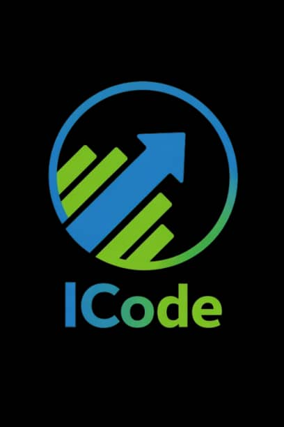

# ICODE CO LTD - Corporate Website



This is the official corporate website for **ICODE CO LTD**, an engineering company focused on designing, building, and deploying secure, scalable, and high-performance digital systems.

## 🚀 Overview

The website is a modern, single-page application (SPA) designed with a premium, dark-mode aesthetic. It serves as a digital portfolio and informational hub for the company's enterprise systems, cloud platforms, and flagship projects (like the iMove Mobility Ecosystem).

### Key Features
- **3D Hero Section**: A photorealistic, interactive 3D Earth globe powered by `Three.js` and `React Three Fiber`.
- **Smooth Animations**: High-performance scroll animations and micro-interactions built with `Framer Motion`.
- **Modern UI/UX**: Dark-themed, glassmorphism design utilizing `Tailwind CSS`.
- **Responsive Design**: Fully responsive across mobile, tablet, and desktop viewports.

---

## 🛠️ Technology Stack

- **Framework**: [React 19](https://react.dev/) + [Vite](https://vitejs.dev/)
- **Styling**: [Tailwind CSS v4](https://tailwindcss.com/)
- **3D Rendering**: [Three.js](https://threejs.org/) & [@react-three/fiber](https://docs.pmnd.rs/react-three-fiber/)
- **Animations**: [Framer Motion](https://www.framer.com/motion/)
- **Icons**: [Lucide React](https://lucide.dev/)

---

## 💻 Running Locally

To run the project on your local machine for development:

### 1. Prerequisites
Make sure you have [Node.js](https://nodejs.org/) (version 20.19+ or 22.12+) installed.

### 2. Install Dependencies
Navigate to the root directory and install the required packages:
```bash
npm install
```

### 3. Start the Development Server
```bash
npm run dev
```
The application will be accessible at `http://localhost:5173/` (or the port specified in your terminal).

### 4. Build for Production
To create a production-ready build:
```bash
npm run build
```
The optimized files will be generated in the `dist/` directory.

---

## 📂 Project Structure

- `src/App.jsx`: The main landing page combining all sections (Hero, About, iMove Showcase, Capabilities, Tech Stack, Team, and Footer).
- `src/components/Navbar.jsx`: The responsive, animated top navigation bar.
- `src/components/Globe3D.jsx`: The custom Three.js component responsible for rendering the photorealistic animated 3D globe.
- `src/components/Section.jsx`: A reusable layout wrapper for standardizing section padding and alignment.
- `src/index.css`: Global styles, custom fonts (Inter & Fira Code), and Tailwind CSS initialization.
- `src/assets/`: Contains project imagery (logos, mockups, background gradients).

---

## 🌍 Design & Assets
- The 3D Globe uses high-resolution satellite imagery loaded dynamically via CDNs (Blue Marble, topology bump maps, and specular water maps) to create a cinematic, realistic Earth.
- The brand colors feature a distinct **Blue (#2196F3)** and **Green (#6DBE45)** palette, applied throughout the site's typography, icons, and lighting models.

---
*© ICODE CO LTD. Engineering Scalable Digital Infrastructure.*
